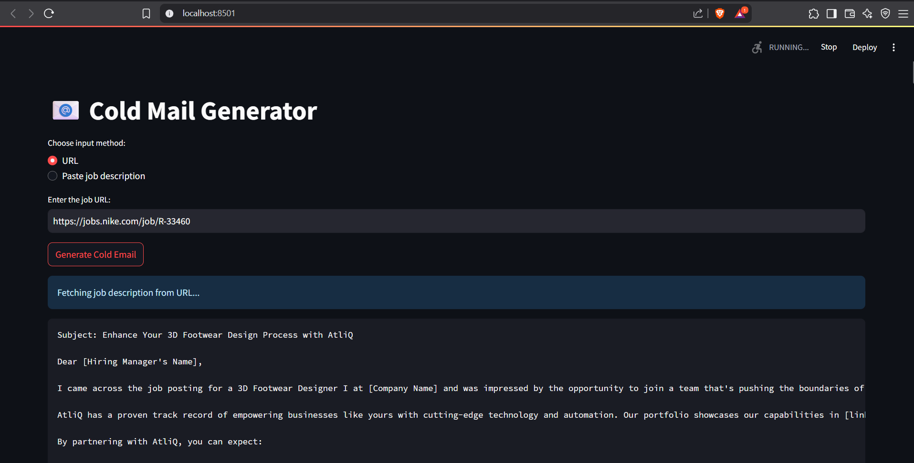

# 📧 Cold Mail Generator
A cold email generator built using Streamlit, LangChain, and GROQ. It allows users to input either:

          a job URL (e.g., from a company's careers page), or

          directly paste the job description.

The tool fetches or parses the job details, then queries a vector database to retrieve relevant portfolio items. It generates a personalized cold email tailored to the role, enabling service companies to pitch their offerings to hiring firms.

**Imagine a scenario:**

- Nike needs a Principal Software Engineer and is spending time and resources in the hiring process, on boarding, training etc
- Atliq is Software Development company can provide a dedicated software development engineer to Nike. So, the business development executive (Mohan) from Atliq is going to reach out to Nike via a cold email.

## Architecture Diagram

